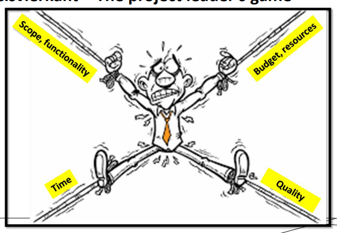

# Software Analysis

Okey let's try it this way

## Examen

Examen zal een deel gesloten boek zijn, deze versie heeft meerkeuzevragen zonder GIS-correctie. Verder is er nog een
deel Open boek (zonder internet),
waarbij de focus vooral gaat liggen op de praktijk.

Multiple choice => 10 stellingen krijgen, en dan zeggen of het functioneel of niet-functioneel is. (gaat niet altijd in
sofware zijn.)

Multiple choice => Wat zit er in welke scope (scope, project scope of product scope)

Multiple choice => vragen goed lezen: requirements zijn functioneel en non-functionele

NIET VANBUITEN BLOKKEN: Je moet het begrijpen. Niet dat ik ooit echt iets vanbuiten leer, maar toch, dit sowiso niet
doen

### PE

Functionele requirements zijn vooral belangrijk
(Je moet een stakeholder analyse maken.)

## introduction

### Wat zijn Requirements?

Je hebt verschillende soorten requirements; bijvoorbeeld User Requirements of Software Requirements.

### User Requirements

Ait, je hebt je billion dollar idea, maar als geen input vraagt van de eindgebruikers gaat je app niet handig zijn voor
hun.
Als voorbeeld kun je kijken naar CSS of Markdown, die (css eigenlijk, markdown wordt niet meer aangepast) hebben in het
begin niet echt geluisterd naar feedback en nu heb je een flexbox met justify content of align content-situatie wat mij
doet denken aan Murphy's Law, everything that can go wrong will go wrong.

Maar daarbuiten, wat zijn User Requirements: Dit zijn vereiste die de eindgebruiker nodig heeft om de app goed te
gebruiken.
Nu ja, eindgebruiker is zo een nederlands woord. Laten we daar vanaf nu gewoon stakeholder tegen zeggen. Is dit exact
hetzelfde? Neuwpe.
Eindgebruikers zijn vaak wel stakeholders; maar stakeholders zijn niet altijd eindgebruikers.

Je moet in principe met je klant gaan meedenken. Kijken hoe ze het vandaag doet,...

#### Primary stakeholder

Een Primary StakeHolder is iemand die vanop de eerste lijn invloed heeft op je software. De veranderingen hebben dus een
directe impact op je Primary Stakeholder. Als je nu een Dark theme gaat maken voor iemand die niet graag naar donkere
kleuren gaat kijken dan heeft deze persoon er niet veel aan.

#### Secondary Stakeholder

Dit zijn de stakeholders die niet echt een directe impact voelen van je app, maar die wel het recht en the audacity
hebben om gewoon mee te beslissen wat gij niet moogt doen of welke dingen ge moet doen. Denk maar aan de GDPR wetgeving
of de europese overheid met de USB-C Shizzle.

#### WHY!?!?

Honestly, betere communicatie. Dat is eigenlijk de reden, door je user requirements zo goed mogelijk te maken ben je
zeker dat je iets maakt wat de gebruiker wilt en kan gebruiken.

### User Stories

WOOOP je hebt de basic requirements. That's good! Ik ben trots, nu gaan we deze omgieten naar mooie User stories. Wat
zijn dat hoor ik je al denken achter je computer scherm.
Easy. Dat is DE ROL + DE REQUIREMENT + DE WHYYYY;
> ### For example:
>_als_ __BARBIE__ _wil ik dat_ __MIJN APP ROOS MET WIT__ _is omdat_ **IK DAT MOOI VIND**.
>
>_als_ __ROMEIN__ _wil ik dat_ __IK MIJ NIET CONTINU AAN MIJN ZWAARD SNIJ__ _is omdat_ **IK DAN EEN AWIE HEB**.

### Algemeen Voorbeeld

> _Er moet een applicatie gebouwd worden om bezoekers te registreren._
>
> (Hier wordt er maar van 1 requirement gebruik gemaakt, maar in een echte applicatie zijn er enorm veel requirements)
> #### Requirement
> Van de secretaresse:
>
> Ze moet gebruikers automatisch registreren
>
> #### User story
> Als secretaresse moet ik gebruikers automatisch kunnen registreren omdat ik momenteel 2 minuten per persoon nodig heb
> om ze te registreren en dit enorm lang duurt

## Business opportunities(kunnen er meer zijn)

Deze stap moet je als eerste doen. Waarom zou je je stock online zetten? Wat zou je doen
Waarom zouden mensen hun app willen maken?

### Business Requirements

Deze hebben User requirements, die requirements leiden tot user stories, user stories leiden tot proces stappen.

> ### VOORBEELD
> SCOUTS JAARLIJKS OP KAMP => KOST GELD;
>
> Om geld binnen te krijgen wordt er wel eens een steak-dag ofzo georganiseerd. Maar die willen eigenlijk gewoon een
> fuif organiseren als info-actie, because why wouldn't you want to drink yourself to the pleuris en tegelijk nog eens
> scouts blij maken.
>
> WEKLE DINGEN MOETEN ER BIJ ZIJN.
>
> #### Business opportunity:
> geld inzamelen voor het kamp goedkoper te maken
>
> #### REQUIREMENTS
>
> | Niveau (P/S)  |        Stakeholders?        | Requirement             |
> |:-------------:|:---------------------------:|:------------------------|
> |               |       DJ + Artiesten        | Muziek                  |
> |               |     HORECA leveranceirs     | Drank en eetvoorziening |
> |               |      Leverancier tent       | Tent leveren + opzetten |
> |       S       |       Lokale overheid       | Vergunning              |
> |               |          Marketing          | (online) Ticketing      |
> |               |      Eigenaar locatie       | Locatie toestemming     |
> |               |          Security           | veiligheid waarborgen   |
> |               | leverancier infrastructuur  | podium / infrastructuur |
> |               |     personeel / helpers     | fuif ondersteunen       |
> |               |     Personeel / helpers     | drank bonnen verkopen   |
> |               |          Bezoekers          | Fun maken               |
> |       S       |       Buurt bewoners        | Geluidsoverlast         |
>

### Fases kort uitgelegd.

#### Concept

=> Visie en startegie => Business opportunity.
Agenda wordt gemaakt, budget wordt besloten (wordt ook gemaakt als mandagen => 1 mandag = 8 uur)

#### Requirements

Hier wordt de stakeholders analyse gemaakt  
=> Wie is Premiere, wie is secundaire;

Dan maken we de User requirements etc,  
dit doen we met een AS-IS:  
=> Hoe doet de persoon het nu?

Doordat je deze situatie nu begrijpt en omdat je weet hoe ze het momenteel doen, ga je besluiten hoe het er uit gaat
zien:  
=> De TO-BE Situatie:  
=> De situatie waar het naar toe gaat. Wat moet het eindproduct

Dan komen we in de Requirements fase.

##### Functionele Requirement

Wordt het meeste naar gekeken
dingen die je kunt programmeren,...

##### Niet-Functionele Requirement

Constraints requirements
Verbied iets, of zorg het
> Bijvoorbeeld: Het moet in Java ontwikkeld worden,

Quality requirements

> Bijvoorbeeld: of bijvoorbeeld Het systeem moet gebruiksvriendelijk zijn

### ISO

Voor de software requirements bestaat ISO 25010 => Vooral niet-Functionele Requirements.

### Scope

Scope = Project scope + Product scope

Product scope => User stories => Oplijsting wat gaat het PRODUCT KUNNEN (niet hoe gaan we het maken)
> bijv: Smartphone => Moet kunnen bellen, sms'en, internetten,...

project scope => Mensen, middelen, materialen => Wat hebben we nodig om het product te KUNNEN MAKEN
> bijv: smartphone => wordt gemaakt van Titanium, door x-aantal personen,...

### DuivelsVierkant:

  
Alle 4 Beinvloeden elkaar, dus als 1 van de 4 dingen veranderen, moeten de andere ook bekeken worden.

> Hier zitten nog een aantal zaken van week 2 tussen.

## The role of the analyst + recap case

Dat wordt een Business Analyst genoemd. Wij gaan met de definitie van IIBA Definition of a Business Analyst.  
_"A business analyst is any person who performs business analysis activities, no matter what their job title or
organizational role may be."_

